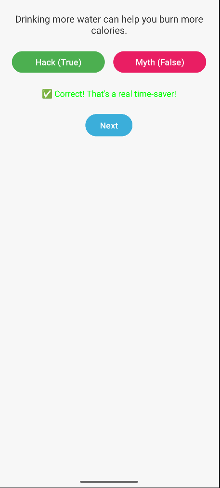

# MyLifeHackOrMythApp
STUDENT NUMBER: ST10527400
##  Project Purpose

This Android application was developed to address the common challenge faced by first-year university students in distinguishing practical life hacks from misleading urban myths circulating online.

---

##  Application Overview

**MyLifeHackOrMythApp** is an interactive flashcard-style quiz that helps users test their knowledge to identify real-life productivity hacks versus common myths.

Users are presented with a series of statements and must decide whether each one is:

*  **Life Hack (True)**
*  **Urban Myth (False)**

The app provides instant feedback, tracks performance, and displays a final score with personalised feedback.

| Quiz Screen | Score Screen | 
|-------------|--------------|
|  |  |
---

##  Features

###  User Interface (UI)

* **Welcome Screen**

  * Displays a brief description and welcome message
  * “Start” button to begin the quiz

* **Flashcard Question Screen**

  * Displays one statement at a time
  * Two answer buttons: **Hack (True)** and **Myth (False)**
  * “Next” button to move to the next question
  * Immediate feedback after each answer

* **Score Screen**

  * Displays total correct answers
  * Personalised feedback (e.g. *"Master Hacker!"* or *"Stay Safe Online!"*)
  * “Review” button to view all questions with correct answers and explanations

---

### Welcome Screen Logic

* When the user clicks **Start**, they are taken directly to the Flashcard Question Screen.

### Flashcard Question Logic

* Questions are displayed one at a time in a loop
* User selects an answer:

  * Feedback is shown (Correct/Incorrect)
  * Score is updated if correct
* User clicks **Next** to continue
* Process repeats until all questions are completed

### Score Screen Logic

* The final score is calculated after the last question
* Your feedback is displayed based on performance
* User's are able to:

  * Review their answers
  * Restart the quiz

---

##  Testing

### Manual Testing

The following were verified:

* Navigation between screens works correctly
* All questions display properly
* Feedback messages are ok
* Score calculation is correct
* Retry button works
* All buttons are functional

### Automated Testing

* **GitHub Actions** used to:

  * Build the project automatically
  * Ensure code runs outside local environment

---

##  Documentation

This README serves as part of the project documentation and includes:

* Purpose of the app
* Design and functionality overview
* Technical implementation details
* Testing approach

---

##  Video Demonstration

Youtube video link: https://youtu.be/pGRewxut-Pw

---

##  References

* GeeksforGeeks (2022) *How to Go Back to Previous Activity in Android?*
  https://www.geeksforgeeks.org/android/how-to-go-back-to-previous-activity-in-android/

* Stack Overflow (2018) *Why Android Studio emulator is extremely slow?*
  https://stackoverflow.com/questions/52600963/why-android-studio-emulator-is-extremely-slow

  STUDENT NUMBER: ST10527400

---

